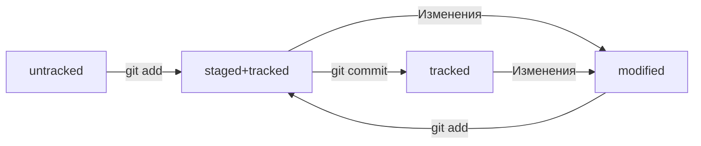

# Курс по Git
## Справочник команд GitBash
| Команда | Описание |
| --- | --- |
| pwd |print working directory|
| cd | change directory|
| cd ~ | Переход в домашнюю директорию|
| ls	| list directory contents|
| cd .. | Переход в дирректорию уровнем выше|
| ls -a | Вывести расширенный список содержимого|
| touch | Создание файла|
| mkdir	| Создание каталога|
| mkdir -p | Создание структуры каталогов|
| cp | Копирование файлов|
| mv | Перемещение файлов|
| cat | concatenate and print|
| rm | remove|
| rmdir | remove directory|
| rm -r | Удалить папку со всем содержимым|
| echo "test" | Вывод текста на экран|
| && | Объединение команд|
| echo "Новая строка" > file.txt| Перезаписать файла|
| echo "Вторая строка файла" >> file.txt| Добавить строку в файл|

## Справочник команд Git
| Команда | Описание |
| --- | --- |
| cat ~/.gitconfig | Текущие настройки |
| git config --list | Текущие настройки |
| git init | Сделать папку репозиторием |
| rm -rf .git | "Разгитить" каталог |
| git status | Проверить состояние репозитория|
| git status --ignored | Состояние репозитория, включая игнорируемые файлы|
| git add --all | Добавить в отслеживание все файлы |
| git add todo.txt | Добавить в отслеживание файл todo.txt |
| git add . | Добавить в отслеживание текущую папку |
| git restore --staged \<file\> | Убрать файл из staging (unstage)|
| git restore --staged .| Убрать из staging всю текущую папку|
| git restore \<file\>| Откатить файл до последней версии|
| git commit | Выполнить коммит |
| git commit -m "Comment" | Коммит с комментарием |
| git commit --amend -m "Обновлённое сообщение коммита"|Обновить последний коммит|
| git commit --amend --no-edit|Обновить последний коммит, сохранив комментарий|
| git diff | Сравнить последнюю закомиченную версию с modified |
| git diff --staged | Сравнить последнюю закомиченную версию со staged |
| git diff hash001 hash002 | Сравнить два коммита идентифицированных заданными хешами |
| git reset --hard \<commit hash\> | Откатить коммит|
| git log | Просмотреть историю коммитов |
| git log --oneline | Сокращенная история коммитов |
| ssh-keygen -t ed25519 -C "email@domain.com" | Генерация ключа SSH |
| clip < ~/.ssh/id_ed25519.pub | Копирование содержимого файла в буфер обмена |
| ssh -T git@github.com | Проверка авторизации |
| git remote add origin git@github.com:account/project.git | Привязка удаленного репозитория к локальному |
| git remote -v | Проверка связи репозиториев |
| git push | Отправить изменения на удаленный репозиторий |
| git push -u origin master | Привязка удаленной ветки к локальной (нужно один раз) |
| git clone git@github.com:yandex-praktikum/git-clone-lesson.git | Клонировать репозиторий в текущий каталог|
| git branch | Просмотреть ветки проекта |
| git branch <название_ветки> | Создание ветки |
| git checkout <название_ветки> | Переключение ветки |
| git checkout -b <название_ветки> | Создать ветку и сразу переключиться на нее |
| git diff <название_ветки1> <название_ветки2> | Сравнуть ветки|
| git merge <название_ветки> | Выполнить слияние ветки (влить названную в текущую)|
| git branch -D <название_ветки> | Удалить ветку после объединения |
| git branch -d <название_ветки> | Удалить ветку, только если она была полностью объединена с другой |
| git pull | Подтянуть изменения из удаленного репозитория в локальный |
## Разметка Markdown для файла README.md
Ссылки:
- [https://gist.github.com/fomvasss/8dd8cd7f88c67a4e3727f9d39224a84c](https://gist.github.com/fomvasss/8dd8cd7f88c67a4e3727f9d39224a84c) 
- [https://www.markdownguide.org/cheat-sheet/](https://www.markdownguide.org/cheat-sheet/)

Схемы marmaid:
- [https://github.blog/2022-02-14-include-diagrams-markdown-files-mermaid/](Описание)
- [https://mermaid.live/](LiveEditor)
## Хеш
- Используется алгоритм SHA-1, 40 символов  
- Хеш - основной идентификатор коммита  
- Git хранит таблицу соответсвий хеш -> информация о коммите
## Лог
Вывод полного лога: ```git log```  
Вывод сокращенного лога ```git log --oneline```  
Хеш в сокращшенном логе будет содержать столько символов, сколько достаточно для однозначной идентификации коммита  
Каждая запись лога содержит: 
- Хеш
- Author (автор)
- Date (дата, время)
- Комментарий (сообщение)
## HEAD
Файл ```.git/HEAD``` указывает на последний коммит(на самый новый) ```refs/heads/master```, в котором, в свою очередь, содержится хеш последнего коммита   
Слово ```HEAD``` можно использовать вместо хеша последнего коммита в командах
## Статусы файла
  



## Оформление сообщений к коммитам
В выводе команды ```git log --online``` будет отражено только 72 первых символа  

Стили формления комментариев к коммитам:
- В корпоративном стиле оформления комментариев принято указывать номер задачи, которую решает данный коммит, например: ```LGS-239: Дополнить список пасхалок новыми числами```  
- Conventional Commits имеет такой формат ```<type>: <сообщение>```, где ```type```, например может быть ```feat``` или ```fix```
- GitHub-стиль: в любом месте собщения указать ```#<номер задачи>```, например ```Исправить #334, добавить график температуры```. В таком случае, github свяжет коммит и задачу

В русском языке рекомендуют использовать инфинитивы, например ```добавить```, ```исправить```
В английском - повелительное наклонение, например ```Use```, ```Fix```

## Игнорирование файлов
Список файлов для игнорирования можно сохранить в файле ```.gitignore``` в корне репозитория
Примеры содержимого файла:
```
# для macOS
.DS_Store

# игнорировать все файлы, которые заканчиваются на .jpeg
*.jpeg

# игнорировать все файлы "tmp" во всех подпапках папки docs
docs/*/tmp 

# странное, но возможное правило
# "игнорировать все файлы"
*

# Вопросительный знак - один символ
file?.txt

# игнорировать файлы file0.txt, file1.txt и file2.txt
# при этом не игнорировать file3.txt, file4.txt, ...
file[0-2].txt

# игнорировать todo.txt в корне репозитория
/todo.txt

# для сравнения: spam.txt будет игнорироваться во всех папках
spam.txt 

# игнорировать папку build
build/

# игнорировать файлы "docs/current/tmp", "docs/old/tmp",
# а также "docs/old/saved/a/b/c/d/tmp"
# и даже "docs/tmp", потому что ноль вложенных папок тоже подходит
docs/**/tmp

# игнорировать только "docs/current/tmp" и "docs/old/tmp"
# файл "docs/old/saved/a/b/c/d/tmp" не попадает в правило
docs/*/tmp 

# игнорировать все JPEG-файлы
*.jpeg

# но только не мем с Doge
!doge.jpeg 
```
Еще один пример
```
# игнорировать все файлы в каталоге build
build/

# игнорировать все .log файлы
*.log

# не игнорировать *.log файлы в examples
# потому что это пример для документации
!examples/**/*.log 
```

## Ветки (branch)
Создание ветки выполняется командой ```git branch <Название>```. Форматы именования веток могут быть разными.
Название ветки в Git может состоять из букв, цифр, а также включать любой из четырёх символов: ```.```,```-```,```_```,```/```
Один из возможных подходов к именованию - использование указателей (ключевых слов), слеша в качестве разделителя и далее описание решаемой задачи. 
Например:
- ```feature/BOARD-123```
- ```bugfix/Case-123```

## Суффикс навигации
Для навигации между коммитами можно использовать `~N`, где `N` - количество коммитов от текущего
Примеры:

Пример | Описание
--- | ---
HEAD~1 | Следующий за текущим коммит
HEAD~ | Следующий за текущим коммит
HEAD~0|Текущий коммит
main~5|Пятый коммит в ветке main