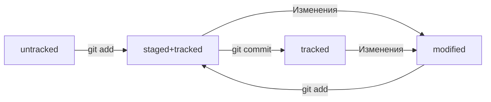

# Курс по Git
## Справочник команд GitBash
| Команда | Описание |
| --- | --- |
| pwd |print working directory|
| cd | change directory|
| cd ~ | Переход в домашнюю директорию|
| ls	| list directory contents|
| cd .. | Переход в дирректорию уровнем выше|
| ls -a | Вывести расширенный список содержимого|
| touch | Создание файла|
| mkdir	| Создание каталога|
| mkdir -p | Создание структуры каталогов|
| cp | Копирование файлов|
| mv | Перемещение файлов|
| cat | concatenate and print|
| rm | remove|
| rmdir | remove directory|
| rm -r | Удалить папку со всем содержимым|
| && | Объединение команд|
## Справочник команд Git
| Команда | Описание |
| --- | --- |
| cat ~/.gitconfig | Текущие настройки |
| git config --list | Текущие настройки |
| git init | Сделать папку репозиторием |
| rm -rf .git | "Разгитить" каталог |
| git status | Проверить состояние репозитория|
| git add --all | Добавить в отслеживание все файлы |
| git add todo.txt | Добавить в отслеживание файл todo.txt |
| git add . | Добавить в отслеживание текущую папку |
| git commit | Выполнить коммит |
| git commit -m "Comment" | Коммит с комментарием |
| git commit --amend -m "Обновлённое сообщение коммита"|Обновить последний коммит|
| git commit --amend --no-edit|Обновить последний коммит, сохранив комментарий|
| git log | Просмотреть историю коммитов |
| git log --oneline | Сокращенная история коммитов |
| ssh-keygen -t ed25519 -C "email@domain.com" | Генерация ключа SSH |
| clip < ~/.ssh/id_ed25519.pub | Копирование содержимого файла в буфер обмена |
| ssh -T git@github.com | Проверка авторизации |
| git remote add origin git@github.com:account/project.git | Привязка удаленного репозитория к локальному |
| git remote -v | Проверка связи репозиториев |
| git push | Отправить изменения на удаленный репозиторий |
| git push -u origin master | Привязка удаленной ветки к локальной (нужно один раз) |
## Разметка Markdown для файла README.md
Ссылки:
- [https://gist.github.com/fomvasss/8dd8cd7f88c67a4e3727f9d39224a84c](https://gist.github.com/fomvasss/8dd8cd7f88c67a4e3727f9d39224a84c) 
- [https://www.markdownguide.org/cheat-sheet/](https://www.markdownguide.org/cheat-sheet/)

Схемы marmaid:
- [https://github.blog/2022-02-14-include-diagrams-markdown-files-mermaid/](Описание)
- [https://mermaid.live/](LiveEditor)
## Хеш
- Используется алгоритм SHA-1, 40 символов  
- Хеш - основной идентификатор коммита  
- Git хранит таблицу соответсвий хеш -> информация о коммите
## Лог
Вывод полного лога: ```git log```  
Вывод сокращенного лога ```git log --oneline```  
Хеш в сокращшенном логе будет содержать столько символов, сколько достаточно для однозначной идентификации коммита  
Каждая запись лога содержит: 
- Хеш
- Author (автор)
- Date (дата, время)
- Комментарий (сообщение)
## HEAD
Файл ```.git/HEAD``` указывает на последний коммит(на самый новый) ```refs/heads/master```, в котором, в свою очередь, содержится хеш последнего коммита   
Слово ```HEAD``` можно использовать вместо хеша последнего коммита в командах
## Статусы файла
  



## Оформление сообщений к коммитам
В выводе команды ```git log --online``` будет отражено только 72 первых символа  

Стили формления комментариев к коммитам:
- В корпоративном стиле оформления комментариев принято указывать номер задачи, которую решает данный коммит, например: ```LGS-239: Дополнить список пасхалок новыми числами```  
- Conventional Commits имеет такой формат ```<type>: <сообщение>```, где ```type```, например может быть ```feat``` или ```fix```
- GitHub-стиль: в любом месте собщения указать ```#<номер задачи>```, например ```Исправить #334, добавить график температуры```. В таком случае, github свяжет коммит и задачу

В русском языке рекомендуют использовать инфинитивы, например ```добавить```, ```исправить```
В английском - повелительное наклонение, например ```Use```, ```Fix```